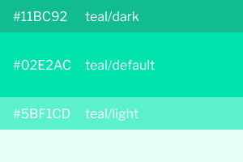

# Colors

## Gitcoin Colors

How do we use colors in general?

Ways to use Colors  
Show all colors without Tints here  
Illustration usage, alerts, anywhere else we use illustrations  
Do's /Don'ts

## Primary Colors

This color should be displayed most frequently and be used for important actions


## Success Colors

This color should be used to show positive feedback or status.



## Danger Colors

This color should be used to show negative feedback or status.


## Warning Colors

This color should be used to show warning feedback or status.


## Grey Colors

This color should be used for backgrounds, icons, and division lines.


## Cascading Style Sheets

```css
$gc-grey-500: #0E0333;
$gc-grey-400: #757087;
$gc-grey-300: #A7A2B6;
$gc-grey-200: #C4C1CF;
$gc-grey-100: #F8F8F8;

$gc-violet-500: #5932C4;
$gc-violet-400: #6F3FF5;
$gc-violet-300: #8C65F7;
$gc-violet-200: #c9b8ff;
$gc-violet-100: #F0EBFF;

$gc-teal-500: #11BC92;
$gc-teal-400: #02E2AC;
$gc-teal-300: #5BF1CD;
$gc-teal-200: #b3ffed;
$gc-teal-100: #E6FFF9;

$gc-pink-500: #D44D6E;
$gc-pink-400: #F3587D;
$gc-pink-300: #F579A6;
$gc-pink-200: #faadbf;
$gc-pink-100: #FDDEE5;

$gc-yellow-500: #E1B815;
$gc-yellow-400: #FFCC00;
$gc-yellow-300: #FFDB4C;
$gc-yellow-200: #ffeea8;
$gc-yellow-100: #FFF8DB;
```

