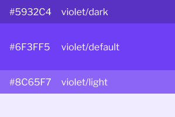
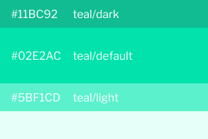
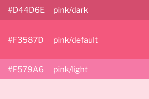
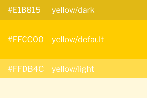
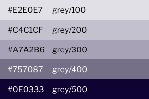

# Colors

### Gitcoin Colors

Show all colors without Tints here

### Primary Colors

This color should be displayed most frequently and be used for important actions

### Success Colors

This color should be used to show positive feedback or status.

### Danger Colors

This color should be used to show negative feedback or status.

### Warning Colors

This color should be used to show warning feedback or status.

### Grey Colors

This color should be used for backgrounds, icons, and division lines.

