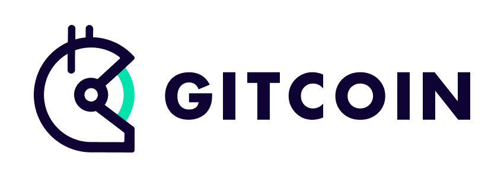
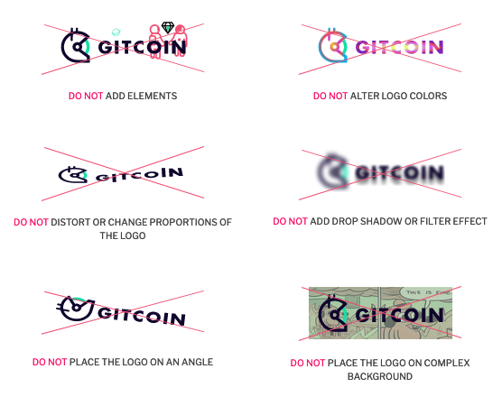

# Logos

## Gitcoin Logo

Our mission is to build and fund digital public goods We empower communities of builders to connect and work together to create the future of the open web.

### Usage

The Gitcoin logo has been designed to effectively promote the brand in its unaltered state and should not be modified or corrupted in any manner. Improper use of the logo compromises the integrity of our brand and makes legal protection more difficult.

These examples represent some of the possible misuses—careful consideration should be given to circumstances that are not illustrated in these examples.

## Products Logo

Below you can find the logos of various Gitcoin products.

## Downloads

[Download Gitcoin Logos](https://s.gitcoin.co/static/v2/images/presskit/Gitcoin_Logos.9d596067b39c.zip)

[Download Gitcoin Product Logos](https://s.gitcoin.co/static/v2/images/presskit/Gitcoin_Products.374b623c9ec8.zip)

[Download GTC Token Logos](https://s.gitcoin.co/static/v2/images/presskit/gtc_token.f203d7e9a51e.zip)

